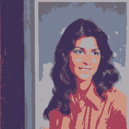

# Color Quantization Using kd-tree for Efficient Color Table Mapping

**Context** : First year project \
**Year** : 2023-2024 \

**Professors** : 

* Luc Brun *luc.brun@ensicaen.fr*
* Patrick Ducrot *patrick.ducrot@ensicaen.fr*

**Students** :

* Johann Ly *johann.ly@ecole.ensicaen.fr*
* Hamza Ouazzani-Chahdi *hamza.ouazzani-chahdi@ecole.ensicaen.fr*

## Description

The goal of this project is to propose a method for color table inversion using a kd-tree.

- A color table inversion method takes as input a 24-bit image and a color table. It outputs an image where each pixel is mapped to its closest color in the table.
- A kd-tree is a binary tree that recursively partitions a set of points (or colors, in our case). kd-trees are widely used for finding the k-nearest neighbors of a given point.

## Results





## Compilation and Usage

### Prerequisites
Make sure you have the following installed on your system:
- **GCC** (a C compiler)
- **Make**
- **ImageMagick** (for PPM image manipulation)

### Compilation
To compile the project, go to the project directory and type:

```sh
make
```

To run it:
```sh
bin/kdtree_method data/IMAGES/fille.ppm data/IMAGES/TABLES/table_fille_128.ppm
```
To clean everything:
```sh
make clean
```

You can find the Doxygen documentation.

## Sources

### Files provided by the Professor Luc Brun
- `classe.h`
- `exit_if.h` 
- `image.h`
- `image.c` 
- `move_type.h` 
- `objet.h` 
- `point.h` 
- `type_obj.h` 

